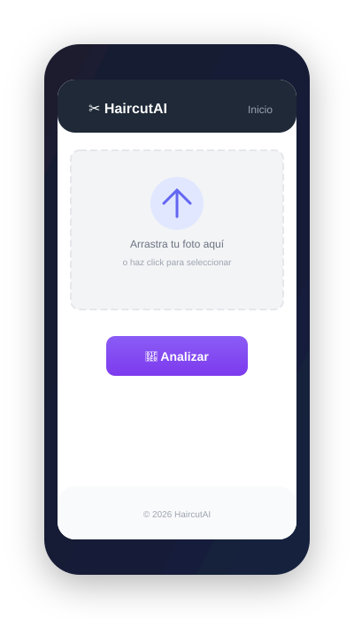

# HaircutAI

  

## Tu barbero personal, pero con inteligencia artificial

¿Alguna vez has salido de una barbería con un corte que no te gustaba? O peor: ¿has pedido "lo mismo de siempre" porque no sabes qué otro estilo podría quedar bien?

No es culpa tuya. Un buen corte de cabello no es solo cuestión de tendencia — depende de la forma de tu rostro, el tipo de tu cabello, tus facciones. Lo que le queda increíble a tu amigo puede no funcionar para ti.

**HaircutAI existe para resolver ese problema.**

## ¿Qué hace?

Como un estilista que te mira y sabe exactamente qué estilo te favorece, pero usando inteligencia artificial.

Subes una foto de tu rostro, y la IA analiza todo: la forma de tu cara, tu tipo de cabello, tu densidad, tus facciones. Después, te recomienda 3 cortes que realmente van a quedar bien contigo — no genéricos, sino pensados para ti.

Y no solo te dice "este corte es bueno". Te explica **por qué** te queda bien y **qué decirle a tu barbero** para conseguirlo.

## Para quién fue creado

Para ese hombre que sabe que quiere verse mejor, pero no sabe por dónde empezar. Para quien tiene una barbería favorita pero siente que siempre pide lo mismo por costumbre. Para quien quiere un cambio pero tiene miedo de equivocarse.

Básicamente, para ti.

## ¿Cómo funciona?

Piensa en esto: anteriormente ir al barbero era como ir al supermercado sin lista — llegabas y pedías "algo bonito". Ahora, con HaircutAI, es como tener un mapa antes del viaje: sabes exactamente a dónde vas y por qué.

  

1. **Subes una foto** — solo necesitas una selfie con buena luz
2. **La IA analiza tus rasgos** — forma de rostro, tipo de cabello, densidad, todo
3. **Recibes 3 recomendaciones** — cada una con nombre, descripción y por qué te queda bien
4. **Aprendes a pedirlo** — un bloque de texto que le puedes mostrar directo a tu barbero

## El equipo detrás

Un proyecto en desarrollo como MVP (producto mínimo viable), construido con amor por el detalle y muchas ganas de que la tecnología ayude a la gente a verse como se merece.

---

*Porque un buen corte de cabello no es vanidad — es confianza.*
